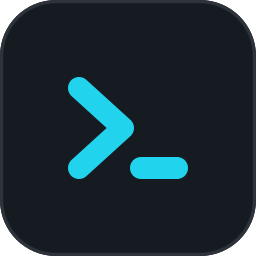

<p align="center">
  
</p>

<h1 align="center">PocketShell Desktop</h1>

<p align="center">
  A keyboard-first SSH client for the dev box you already use.<br>
  Real terminals. Live aplexer sessions. The agents running inside them.
</p>

<p align="center">
  <a href="https://github.com/PocketShell-io/pocketshell-desktop/releases/latest"></a>
  &nbsp;
  <a href="https://github.com/PocketShell-io/pocketshell-desktop/actions/workflows/publish.yml"></a>
  &nbsp;
  <a href="#license"></a>
</p>

<p align="center">
  <a href="https://github.com/PocketShell-io/pocketshell-desktop/releases/latest"><strong>Download</strong></a>
  &nbsp;·&nbsp;
  <a href="#install">Install</a>
  &nbsp;·&nbsp;
  <a href="#what-you-work-with">Features</a>
  &nbsp;·&nbsp;
  <a href="#keyboard">Keyboard</a>
  &nbsp;·&nbsp;
  <a href="https://github.com/PocketShell-io/pocketshell">Android app</a>
</p>

---

Pick a machine from `~/.ssh/config`. See every session running on it. Work in the terminal, edit files, forward ports, and draft what you send to Claude Code, Codex, OpenCode, or Grok. Close the laptop. Come back tomorrow. The session is still there, on the box.

PocketShell Desktop is the desktop sibling of the [PocketShell](https://github.com/PocketShell-io/pocketshell) Android client. Both talk to the same host helper. Your state lives on the box.

```text
this machine                              the dev box
┌─────────────────────┐    SSH     ┌──────────────────────────┐
│ PocketShell Desktop │ ─────────► │ aplexer sessions         │
│ terminal · files    │            │ pocketshell helper       │
│ composer · forwards │            │ agents · quota · env     │
└─────────────────────┘            └──────────────────────────┘
```

The app attaches to a session the host already owns. Those sessions are aplexer sessions, reached through the `pocketshell` helper. Joining opens a shell channel onto `a attach`, and xterm.js renders whatever the far end draws.

## What you work with

<table>
<tr>
<td width="50%" valign="top">

### Sessions

Every aplexer session on the host, with its last activity and a mark for the agent running in it. Sessions that share a project folder open as one workspace: a tab per session, plus a Files tab. Rename from the tab. Start a new one, with an agent of your choice, from the workspace menu. A folder can also open in VS Code over Remote SSH.

</td>
<td width="50%" valign="top">

### Prompt composer

A side panel for what you send to an agent. Multi-line, resizable, with file attachments. Each workspace keeps its own draft, so switching tabs leaves the text where you typed it. <kbd>Ctrl</kbd>+<kbd>`</kbd> toggles it. <kbd>Enter</kbd> sends. Typing in a workspace can open it for you.

</td>
</tr>
<tr>
<td width="50%" valign="top">

### Files

A file browser over SFTP. Walk the remote tree, edit text in the built-in editor, preview images and HTML, Markdown, and SVG, and upload or download by drag-and-drop. Create, rename, and delete on the host. Save writes the file back.

</td>
<td width="50%" valign="top">

### Port forwarding

Local, remote, and dynamic SOCKS forwards. Add them yourself, or let auto-forward watch which ports are listening on the server and mirror them locally. Each rule shows status, bytes, and speed. An HTTP forward opens in the browser in one click. Setups are remembered per host.

</td>
</tr>
<tr>
<td width="50%" valign="top">

### Usage and environment

A quota view reads what is left for each AI provider, and when it resets, from the helper on the server. A per-folder env editor inspects and changes the environment those agents run with. Provider credentials stay on the box.

</td>
<td width="50%" valign="top">

### The connection

Hosts come from `~/.ssh/config`, with a manual add when a host is not listed. Host keys are checked against `known_hosts`: an unknown key asks, a mismatch stops. On connect the app reports when the helper is missing. A dropped network reconnects and brings sessions and forwards back.

</td>
</tr>
</table>

## Three rules

- **The session lives on the server.** Aplexer keeps it, and the `pocketshell` helper is how this app reaches it. The desktop is a window, and it reconnects freely.
- **Secrets stay on the host.** Quota, agent identity, and repo data are read there. A key passphrase is used for one connect and then forgotten.
- **The shell keeps its keys.** Anything a terminal can already send still reaches the shell. The app binds only what a terminal cannot use, and every binding is listed and rebindable in **Settings → Keyboard**.

## Install

Windows, macOS, and Linux. Each ships x64 and arm64.

| | You get |
|---|---|
| Windows | A zip. Unpack it and run it. |
| macOS | A disk image and a zip, for Apple silicon and Intel. |
| Linux | An AppImage and a `.deb`. |

Grab the latest build from [Releases](https://github.com/PocketShell-io/pocketshell-desktop/releases/latest).

**On the machine you connect to**, you need SSH with key authentication and the helper, which drives aplexer there:

```bash
uv tool install pocketshell
```

`pipx` works in place of `uv`. The first connect names whatever is still missing.

**From source** you need Node 20 or newer (CI runs on Node 22) and a checkout of [`pocketshell-core`](https://github.com/PocketShell-io/pocketshell-core) beside this repo. The desktop app consumes that sibling through a `file:` dependency.

```bash
git clone git@github.com:PocketShell-io/pocketshell-core.git
git clone git@github.com:PocketShell-io/pocketshell-desktop.git
cd pocketshell-desktop
npm install
npm run dev
```

`npm run dev` rebuilds as you edit. `npm run dist` produces the installers.

## Keyboard

The full list, and the place to rebind it, is **Settings → Keyboard**. Start here:

| Keys | Does |
|---|---|
| <kbd>Ctrl</kbd>+<kbd>`</kbd> | Toggle the prompt composer |
| <kbd>Ctrl</kbd>+<kbd>[</kbd> / <kbd>]</kbd> | Previous / next tab |
| <kbd>Ctrl</kbd>+<kbd>↑</kbd> / <kbd>↓</kbd> | Move between folder workspaces |
| <kbd>Ctrl</kbd>+<kbd>Shift</kbd>+<kbd>N</kbd> | New session |
| <kbd>Ctrl</kbd>+<kbd>Shift</kbd>+<kbd>C</kbd> / <kbd>V</kbd> | Copy the selection / paste into the composer |
| right-click | Paste into the shell |
| <kbd>Ctrl</kbd>+<kbd>S</kbd> / <kbd>L</kbd> / <kbd>F</kbd> | Save / path bar / filter, on the Files tab |

<kbd>Ctrl</kbd> in this table also matches <kbd>Command</kbd>.

## Develop

| Command | What it runs |
|---|---|
| `npm run dev` | App with hot reload |
| `npm run build` | Production bundle in `out/` |
| `npm run dist` | Installers |
| `npm run typecheck` | Main, preload, and the shared UI |
| `npm run lint` | ESLint |
| `npm run test:unit` | Unit tests, no Docker |
| `npm run test:integration` | Against the Docker fleet |
| `npm run test:e2e` | Playwright driving Electron |
| `npm run smoke` | The pre-release gate |

Integration, end-to-end, and smoke need Docker.

The app runs from `out/`, the built bundle. After a source change outside `npm run dev`, run `npm run build` before launching it.

Stack: Electron, Vue 3, TypeScript, Vite, `ssh2`, xterm.js, CodeMirror 6, Pinia.

## License

[MIT](LICENSE). Copyright © 2026 Alexey Grigorev.
